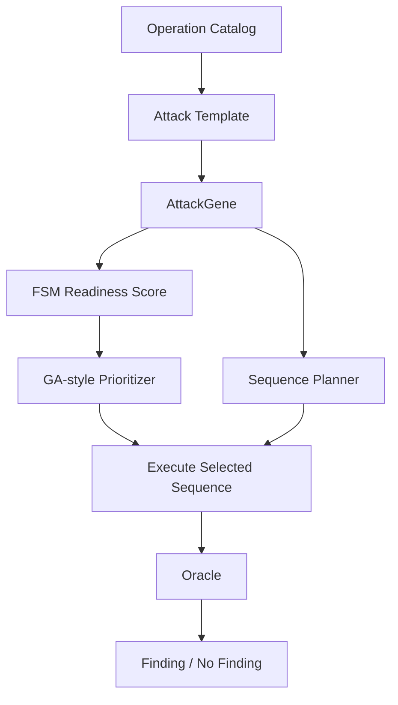

# FSM Design Summary

이 문서는 우리 GraphQL authorization regression testing harness에서 실제로 사용한 FSM을 쉽게 설명하기 위한 정리다.

중요한 전제부터 말하면, 현재 구현은 요청을 실행하면서 상태가 `INIT -> ... -> FOUND`로 한 단계씩 runtime transition되는 완전한 FSM engine은 아니다.

현재 구현은 다음에 가깝다.

> 각 authorization bug type이 finding까지 가기 위해 필요한 logical state sequence를 정의하고, 그 FSM readiness를 AttackGene 생성, GraphQL sequence lowering, GA-style prioritization score에 반영하는 lightweight FSM-guided testing 방식이다.

즉 FSM은 "실행 중 상태 머신"이라기보다, "어떤 테스트 후보가 얼마나 공격 시나리오에 가까운가"를 판단하는 구조적 가이드다.

## 1. FSM이 필요한 이유

Authorization bug는 보통 단일 GraphQL request만으로 확인하기 어렵다.

예를 들어 BOLA read를 확인하려면 다음 순서가 필요하다.

1. user A session 준비
2. user A가 private object 생성
3. 생성된 object id 저장
4. user B session 준비
5. user B가 user A의 object id로 read 시도
6. 응답을 oracle이 판단

그래서 우리 harness는 각 취약점 유형마다 "finding까지 도달하기 위한 상태 흐름"을 FSM처럼 정의했다.

## 2. 전체 구조



역할을 나누면 다음과 같다.

| 파일 | 역할 |
| --- | --- |
| `lib/security-testing/attack_registry.ts` | template별 FSM 단계와 capability 정의 |
| `lib/security-testing/sequence_planner.ts` | FSM 의미에 맞는 실제 GraphQL request sequence 생성 |
| `lib/security-testing/ga_prioritizer.ts` | FSM readiness를 fitness/prioritization score에 반영 |
| `lib/security-testing/evaluation.ts` | `fsmState`를 generation log와 attack-ready metric에 반영 |

## 3. 실제 사용한 FSM 목록

우리 프로젝트에서 사용한 FSM은 총 5개다.

| 취약점 유형 | FSM 목적 |
| --- | --- |
| `BOLA_READ` | 다른 사용자의 object id를 읽을 수 있는지 확인 |
| `BOLA_UPDATE_DELETE` | 다른 사용자의 object를 수정/삭제할 수 있는지 확인 |
| `STALE_OBJECT_ACCESS` | 삭제된 object가 계속 접근 가능한지 확인 |
| `BFLA_ADMIN_LIKE_OP` | 낮은 권한 actor가 admin-like resolver를 실행할 수 있는지 확인 |
| `BOPLA_SENSITIVE_FIELD_READ` | 민감 field가 selection set으로 노출되는지 확인 |

## 4. BOLA_READ FSM

FSM:

```text
INIT
-> SINGLE_SESSION
-> DUAL_SESSION
-> OWN_OBJECT_AVAILABLE
-> FOREIGN_REFERENCE_AVAILABLE
-> ATTACK_READY
-> ATTACK_EXECUTED
-> FOUND
```

의미:

| State | 의미 |
| --- | --- |
| `INIT` | 테스트 후보가 아직 준비되지 않은 초기 상태 |
| `SINGLE_SESSION` | 최소 한 명의 actor session을 사용할 수 있음 |
| `DUAL_SESSION` | owner와 attacker 두 session을 사용할 수 있음 |
| `OWN_OBJECT_AVAILABLE` | owner가 만든 object id를 확보할 수 있음 |
| `FOREIGN_REFERENCE_AVAILABLE` | attacker가 owner object id를 사용할 수 있음 |
| `ATTACK_READY` | cross-user read 시도가 가능함 |
| `ATTACK_EXECUTED` | attacker read request가 실행됨 |
| `FOUND` | oracle이 BOLA read finding으로 판단함 |

실제 sequence:

```text
Auth(owner)
-> CreateOwnedObject(owner)
-> capture object id into ObjectPool
-> Auth(attacker)
-> ReadForeignObject(attacker, ownerObjectId)
-> UnauthBaselineRead(anonymous, ownerObjectId)
```

oracle 판단:

- attacker가 owner의 private object를 id로 읽는다.
- GraphQL error가 없다.
- 반환된 object id가 owner가 만든 object id와 같다.
- anonymous baseline을 함께 봐서 public object 오탐을 줄인다.

## 5. BOLA_UPDATE_DELETE FSM

FSM:

```text
INIT
-> BOLA_READ_READY
-> MUTATION_READY
-> ATTACK_EXECUTED
-> FOUND
```

의미:

| State | 의미 |
| --- | --- |
| `INIT` | 테스트 후보 초기 상태 |
| `BOLA_READ_READY` | owner object id를 이용한 cross-user 접근 시나리오가 구성 가능함 |
| `MUTATION_READY` | update/delete mutation 후보가 있음 |
| `ATTACK_EXECUTED` | attacker가 owner object에 mutation을 실행함 |
| `FOUND` | oracle이 unauthorized update/delete finding으로 판단함 |

실제 sequence:

```text
Auth(owner)
-> CreateOwnedObject(owner)
-> capture object id into ObjectPool
-> Auth(attacker)
-> ModifyForeignObject(attacker, ownerObjectId)
-> VerifyModifiedObject(owner)
```

oracle 판단:

- attacker가 owner object id로 update/delete mutation을 실행한다.
- 응답에 error가 없다.
- mutation 결과가 같은 object id를 반환한다.
- 즉 owner check 없이 foreign object mutation이 성공한 것으로 본다.

## 6. STALE_OBJECT_ACCESS FSM

FSM:

```text
INIT
-> OBJECT_CREATED
-> OBJECT_DELETED
-> STALE_REFERENCE_READY
-> ATTACK_EXECUTED
-> FOUND
```

의미:

| State | 의미 |
| --- | --- |
| `INIT` | 테스트 후보 초기 상태 |
| `OBJECT_CREATED` | 테스트할 object가 생성됨 |
| `OBJECT_DELETED` | object가 delete mutation으로 삭제됨 |
| `STALE_REFERENCE_READY` | 삭제된 object id를 다시 사용할 수 있음 |
| `ATTACK_EXECUTED` | deleted id로 read 시도함 |
| `FOUND` | 삭제된 object가 계속 읽혀 stale access finding으로 판단됨 |

실제 sequence:

```text
Auth(owner)
-> CreateOwnedObject(owner)
-> capture object id into ObjectPool
-> DeleteStaleTarget(owner, objectId)
-> ReadDeletedObject(owner, objectId)
```

oracle 판단:

- delete 이후 read가 성공한다.
- read 결과가 같은 object id를 가진다.
- 반환된 object의 `deleted` 값이 `true`다.
- 즉 soft-deleted object가 여전히 GraphQL resolver에서 노출된다.

## 7. BFLA_ADMIN_LIKE_OP FSM

FSM:

```text
INIT
-> LOW_PRIV_SESSION
-> ADMIN_OP_AVAILABLE
-> ATTACK_READY
-> ATTACK_EXECUTED
-> FOUND
```

의미:

| State | 의미 |
| --- | --- |
| `INIT` | 테스트 후보 초기 상태 |
| `LOW_PRIV_SESSION` | 낮은 권한 actor session을 사용할 수 있음 |
| `ADMIN_OP_AVAILABLE` | admin-like resolver 후보가 있음 |
| `ATTACK_READY` | low-privilege actor가 admin-like resolver를 호출할 준비가 됨 |
| `ATTACK_EXECUTED` | admin-like resolver 호출이 실행됨 |
| `FOUND` | low-privilege actor가 성공적으로 실행해서 finding으로 판단됨 |

실제 sequence:

```text
Auth(attacker)
-> ExecuteAdminLikeOperation(attacker)
```

대상 예시:

- `adminUsers`
- `superSecretPrivateMutation`

oracle 판단:

- low-privilege actor가 admin-like resolver를 실행한다.
- 응답에 error가 없다.
- 의미 있는 data가 반환된다.

## 8. BOPLA_SENSITIVE_FIELD_READ FSM

FSM:

```text
INIT
-> LOW_PRIV_SESSION
-> SENSITIVE_FIELD_SELECTED
-> ATTACK_READY
-> ATTACK_EXECUTED
-> FOUND
```

의미:

| State | 의미 |
| --- | --- |
| `INIT` | 테스트 후보 초기 상태 |
| `LOW_PRIV_SESSION` | 낮은 권한 actor session을 사용할 수 있음 |
| `SENSITIVE_FIELD_SELECTED` | selection set에 민감 field가 포함됨 |
| `ATTACK_READY` | sensitive field read request를 실행할 준비가 됨 |
| `ATTACK_EXECUTED` | sensitive field read request가 실행됨 |
| `FOUND` | 민감 field 값이 response에 포함되어 finding으로 판단됨 |

실제 sequence:

```text
Auth(attacker)
-> ReadSensitiveField(attacker)
```

민감 field 예시:

| Object Type | Sensitive Field |
| --- | --- |
| `User` | `resetToken` |
| `Post` | `internalNote` |
| `Comment` | `moderationNote` |

oracle 판단:

- response에 sensitive field가 존재한다.
- 해당 값이 `null` 또는 `undefined`가 아니다.
- low-privilege actor가 받으면 안 되는 property가 GraphQL selection set으로 노출된 것으로 본다.

## 9. FSM Readiness Scoring

`ga_prioritizer.ts`에서는 각 `AttackGene`이 FSM상 얼마나 준비되어 있는지 점수화한다.

예시:

| Attack Type | 높은 FSM progress 조건 |
| --- | --- |
| `BOLA_READ` | `setupResolver`와 `targetResolver`가 모두 있음 |
| `BOLA_UPDATE_DELETE` | `setupResolver`, `targetResolver`, `verifyResolver`가 모두 있음 |
| `STALE_OBJECT_ACCESS` | `setupResolver`, `deleteResolver`, `targetResolver`가 모두 있음 |
| `BFLA_ADMIN_LIKE_OP` | `targetResolver`가 있음 |
| `BOPLA_SENSITIVE_FIELD_READ` | `targetResolver`와 `sensitiveField`가 있음 |

`ours` mode의 scoring은 대략 다음 요소를 함께 본다.

```text
scoreWithFsm =
  0.45 * fsmProgress
+ 0.25 * securitySurfaceNovelty
+ 0.20 * executableScore
+ 0.10 * oracleSignalProxy
```

각 항목의 의미:

| 항목 | 의미 |
| --- | --- |
| `fsmProgress` | FSM상 공격 시나리오가 얼마나 준비되어 있는가 |
| `securitySurfaceNovelty` | 아직 테스트하지 않은 resolver/type/template인가 |
| `executableScore` | target resolver가 있어 실제 실행 가능한가 |
| `oracleSignalProxy` | oracle이 finding을 판단하기 쉬운 template인가 |

## 10. FSM과 Baseline 차이

| Mode | FSM 사용 여부 | 설명 |
| --- | --- | --- |
| `pure-random-schema` | 사용 안 함 | schema operation만 랜덤 실행 |
| `dependency-only` | 사용 안 함 | dependency/object pool은 쓰지만 OWASP template/FSM은 모름 |
| `template-only` | 약하게 사용 | predefined template 순서 그대로 실행 |
| `random-attack-gene` | 후보 생성에는 반영 | 같은 AttackGene을 random order로 실행 |
| `ga-without-fsm` | 제외 | novelty/capability만 보고 FSM progress는 제외 |
| `ours` | 사용 | FSM progress + novelty + archive 기반 prioritization |

따라서 `ours`와 `ga-without-fsm`의 핵심 차이는 FSM progress를 scoring에 반영하는지 여부다.

## 11. 발표용 한 문장

발표에서는 이렇게 설명하면 정확하다.

> 우리 FSM은 runtime transition engine이 아니라, authorization bug를 찾기 위해 필요한 상태 흐름을 template별로 정의하고, 각 AttackGene이 finding까지 얼마나 가까운지 판단해 GA-style prioritization에 반영하는 lightweight FSM guidance다.

조금 더 짧게 말하면:

> FSM은 테스트 후보를 아무 순서로나 실행하지 않고, owner object 생성, foreign reference 확보, mutation/read 준비, sensitive field selection처럼 finding에 필요한 상태를 갖춘 후보를 우선 실행하도록 돕는 가이드다.

## 12. 주의해서 말해야 할 점

다음 표현은 피하는 것이 좋다.

```text
우리 구현은 완전한 FSM transition engine이다.
```

더 정확한 표현은 다음이다.

```text
우리 구현은 FSM-defined attack templates와 FSM-guided prioritization을 사용한다.
```

현재 구현은 lightweight하지만, 수업 프로젝트 목표에는 충분하다. 이유는 FSM이 다음 세 가지를 실제로 해주기 때문이다.

1. authorization bug type별로 필요한 request sequence를 명확히 정의한다.
2. object pool과 actor session을 어떤 순서로 써야 하는지 정한다.
3. GA-style prioritizer가 더 attack-ready한 후보를 먼저 실행하도록 도와준다.
