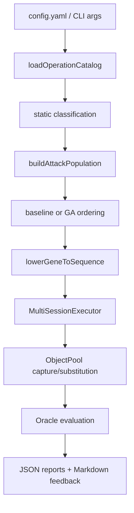

# Team Code Walkthrough: GraphQL Authorization Regression Testing

이 문서는 현재 프로젝트 루트와, 루트 안에 보관된 초기 복사본 `vulnerable-graphql-api/`를 비교해서 우리가 추가하거나 수정한 코드를 팀원들이 빠르게 이해할 수 있도록 정리한 설명서다.

초기 복사본은 "원래 toy vulnerable GraphQL API"이고, 현재 프로젝트 루트는 수업 프로젝트 요구사항을 반영해서 "local authorization regression testing harness가 붙은 lab server"로 확장한 버전이다.

## 0. 비교 기준

비교 대상은 다음 두 위치다.

| 구분 | 경로 | 의미 |
| --- | --- | --- |
| 초기 상태 | `vulnerable-graphql-api/` | 우리가 작업하기 전 원본 서버 복사본 |
| 현재 상태 | 프로젝트 루트 `.` | 서버 확장, 테스트 harness, report 코드가 반영된 버전 |

비교할 때 의미 없는 실행 산출물은 제외했다.

- `.git`
- `node_modules`
- `build`
- sqlite database 파일
- `security-results*`
- `.DS_Store`

비교 결과를 기능 단위로 묶으면 다음과 같다.

| 그룹 | 현재 상태에서 달라진 점 |
| --- | --- |
| 서버 설정 | `app.ts`, `package.json`, `README.md` 변경 |
| GraphQL schema/resolver | post/user/query/mutation 확장, comment type/mutation 추가 |
| DB/model | post field 확장, comment model/table 추가 |
| 테스트 harness | `lib/security-testing/` 전체 신규 추가 |
| 평가 설정 | `config.yaml`, `ground_truth.json` 신규 추가 |
| 문서 | `docs/` 아래 report/feedback/walkthrough 추가 |

## 1. 프로젝트 방향

우리가 만든 프로젝트의 목표는 외부 시스템을 공격하는 도구가 아니라, 우리가 소유한 local vulnerable GraphQL lab server에서 authorization check가 빠졌는지 회귀 테스트하는 자동화 harness를 만드는 것이다.

핵심 요구사항은 다음과 같다.

| 요구사항 | 현재 구현 |
| --- | --- |
| schema 또는 operation catalog 로드 | `lib/security-testing/schema_loader.ts` |
| 두 개의 dummy user session 유지 | `lib/security-testing/executor.ts` |
| 테스트 중 생성한 object pool 유지 | `lib/security-testing/object_pool.ts` |
| predefined authorization scenario 생성 | `lib/security-testing/attack_registry.ts`, `sequence_planner.ts` |
| localhost only 실행 | `config.ts`, `executor.ts` |
| JSON report 생성 | `lib/security-testing/reporter.ts` |
| random/template/GA baseline 비교 | `baseline_planner.ts`, `ga_prioritizer.ts`, `evaluation.ts` |

## 2. 전체 실행 흐름



흐름을 말로 풀면 다음과 같다.

1. `config.yaml`과 CLI option에서 endpoint, budget, seed, output directory를 읽는다.
2. GraphQL schema를 introspection하거나 저장된 catalog를 읽어 operation catalog를 만든다.
3. 각 resolver를 이름, argument, return type, field 기준으로 `create`, `read_by_id`, `update`, `delete`, `admin_like`, `sensitive_surface` 등으로 분류한다.
4. 분류된 operation을 조합해서 authorization regression test 후보인 `AttackGene` 목록을 만든다.
5. 각 baseline 또는 ours 전략이 같은 후보군을 다른 순서로 정렬한다.
6. `AttackGene`을 실제 GraphQL request sequence로 낮춘다.
7. 두 dummy user session으로 sequence를 실행하고, create 결과에서 object id를 object pool에 저장한다.
8. oracle이 결과를 보고 expected authorization failure가 실제로 빠져 있는지 finding으로 판단한다.
9. 결과를 JSON/Markdown report로 저장하고 ground truth와 비교한다.

## 3. 초기 서버 대비 큰 변화

초기 서버는 간단한 `User` / `Post` 중심 GraphQL API였다. 현재 버전은 수업 프로젝트 실험을 위해 다음 영역이 추가되었다.

| 영역 | 초기 서버 | 현재 서버 |
| --- | --- | --- |
| 데이터 모델 | `User`, `Post` 중심 | `Post.deleted`, `Post.internalNote`, `User.resetToken`, 신규 `Comment` 추가 |
| GraphQL surface | post read, create post, login/register 등 | update/delete post, comment CRUD, admin-like query, safe/decoy resolver 추가 |
| 취약점 종류 | 일부 toy vulnerability | BOLA read, BOLA update/delete, stale object access, BFLA, BOPLA를 명시적으로 테스트 가능 |
| 테스트 자동화 | 없음 | `lib/security-testing/` 전체 harness 추가 |
| 결과물 | 수동 GraphiQL 확인 | findings/evaluation/budget curve/ground truth JSON 생성 |

## 4. Lab Server 확장 코드

이 섹션은 "테스트 대상 서버" 쪽 변경이다. 취약점을 실제로 검출할 surface를 만들고, false positive를 확인할 secure decoy도 넣었다.

### 4.1 `app.ts`

변경 내용:

- rate limit의 `max` 값을 `100`에서 `10000`으로 올렸다.
- 테스트 중 생성되는 user id debug log를 제거했다.

이유:

- 자동화 harness는 여러 baseline, seed, budget을 돌리기 때문에 request 수가 많다.
- rate limit이 너무 낮으면 authorization 결과가 아니라 rate-limit 실패가 실험 결과를 가리게 된다.

### 4.2 `models/post.js`

변경 내용:

- `deleted` field 추가.
- `internalNote` field 추가.
- `Post.hasMany(Comment)` association 추가.

의미:

- `deleted`는 stale object access 실험에 필요하다.
- `internalNote`는 object property level authorization, 즉 민감 field 노출 테스트에 필요하다.
- `Comment`와 연결해서 `Post` 하나만 보는 단순 실험에서 벗어나도록 했다.

### 4.3 `models/user.js`

변경 내용:

- `resetToken` field 추가.
- `User.hasMany(Comment)` association 추가.

의미:

- `resetToken`은 `User` object의 sensitive field로 사용된다.
- BOPLA 테스트에서 `me`, `user`, `allUsers`, `adminUsers`, `register`, `passwordReset` 같은 resolver가 민감 field를 노출하는지 확인할 수 있다.

### 4.4 `models/comment.js`

신규 파일이다.

역할:

- `Comment` model을 정의한다.
- 주요 field는 `body`, `public`, `deleted`, `moderationNote`, `user_id`, `post_id`다.

의미:

- `Comment`는 `Post`와 별개의 object type이다.
- 이를 통해 harness가 여러 object type에서 authorization regression을 찾을 수 있는지 확인한다.
- `moderationNote`는 comment-level sensitive field로 사용된다.

### 4.5 migrations

추가된 migration:

- `migrations/20260603000000-add-security-lab-post-fields.js`
- `migrations/20260603000001-create-comment.js`

역할:

- `posts` table에 `deleted`, `internalNote`를 추가한다.
- `comments` table을 생성한다.

팀원이 새 환경에서 실행할 때는 기존 README처럼 migration을 돌려야 이 field와 table이 생긴다.

### 4.6 `lib/gql/types/post.ts`

변경 내용:

- `PostType`에 `deleted`, `internalNote`, `comments` field를 추가했다.
- `SecureGetPostById` resolver를 추가했다.

`SecureGetPostById`의 의미:

- owner가 읽으면 full object를 반환한다.
- public object는 읽을 수 있지만 `internalNote`를 `null`로 sanitize한다.
- private foreign object는 `null`을 반환한다.

이 resolver는 의도적으로 안전하게 만든 decoy다. harness가 안전한 resolver를 취약점으로 오탐하지 않는지 확인하기 위해 ground truth의 secure 항목에 들어간다.

### 4.7 `lib/gql/types/comment.ts`

신규 파일이다.

역할:

- `CommentType`을 정의한다.
- `GetCommentById`, `GetAllComments` resolver를 정의한다.

의도:

- `comment(id)`는 object id 기반 read surface다.
- `allComments`는 list read surface이자 sensitive field selection 테스트에 쓰인다.
- `moderationNote`를 노출할 수 있기 때문에 BOPLA 후보가 된다.

### 4.8 `lib/gql/types/user.ts`

변경 내용:

- `UserType`에 `resetToken` field를 추가했다.
- `AdminUsers` resolver를 추가했다.

의미:

- `resetToken`은 low-privilege actor가 받아서는 안 되는 sensitive property다.
- `AdminUsers`는 이름과 동작이 admin-like인데 role check가 없는 resolver로, BFLA 테스트 대상이다.

### 4.9 `lib/gql/types/query.ts`

변경 내용:

- `securePost`
- `comment`
- `allComments`
- `adminUsers`
- `health`
- `publicFeed`

등을 root query에 연결했다.

의미:

- `securePost`는 FP 방지용 secure decoy다.
- `comment`, `allComments`, `adminUsers`는 authorization regression surface다.
- `health`, `publicFeed`는 noise/decoy 성격의 safe-ish resolver다. 모든 operation이 finding 후보가 되지 않도록 schema를 조금 더 현실적으로 만든다.

### 4.10 `lib/gql/types/mutation.ts`

변경 내용:

- `updatePost`
- `deletePost`
- `createComment`
- `updateComment`
- `deleteComment`

를 root mutation에 추가했다.

의미:

- read만 테스트하면 BOLA read에 치우친다.
- update/delete를 추가해서 "남의 object를 수정/삭제할 수 있는가"와 "삭제된 object가 계속 읽히는가"도 확인한다.

### 4.11 `lib/gql/mutations/create_post.ts`

변경 내용:

- 생성되는 post에 `deleted: false`를 넣는다.
- `internalNote` 기본값을 넣는다.

의미:

- create 결과가 object pool에 들어간 뒤 update/delete/read 테스트의 seed object가 된다.
- `internalNote`가 있어야 post-level BOPLA 테스트가 가능하다.

### 4.12 `lib/gql/mutations/update_post.ts`

신규 파일이다.

구성:

- `UpdatePost`
- `DeletePost`

의도:

- `UpdatePost`는 owner check 없이 `id`로 post를 찾아 수정한다.
- `DeletePost`는 hard delete가 아니라 `deleted = true`로 soft delete한다.

의미:

- `UpdatePost`는 BOLA update/delete 테스트 대상이다.
- `DeletePost`는 BOLA delete와 stale object access 테스트에 동시에 쓰인다.
- soft delete 후 `post(id)`가 여전히 object를 반환하면 stale object finding이 된다.

### 4.13 `lib/gql/mutations/comment_mutations.ts`

신규 파일이다.

구성:

- `CreateComment`
- `UpdateComment`
- `DeleteComment`

의도:

- `CreateComment`는 comment object를 생성하고 object pool에 넣을 수 있게 한다.
- `UpdateComment`, `DeleteComment`는 owner check 없이 동작하도록 만든 lab vulnerability다.
- `DeleteComment`도 soft delete를 사용한다.

의미:

- `Comment` object type에서도 BOLA read, update/delete, stale object access, BOPLA를 평가할 수 있다.

### 4.14 `lib/gql/mutations/authentication.ts`

변경 내용:

- 불필요한 debug log와 unused import를 정리했다.

의미:

- 테스트 결과를 볼 때 console noise를 줄였다.
- 기능적 핵심 변경은 `User.resetToken`이 schema/model에 추가되면서 BOPLA surface가 생긴 점이다.

## 5. Security Testing Harness 코드

이 섹션은 우리가 새로 만든 자동화 framework인 `lib/security-testing/` 설명이다.

### 5.1 `types.ts`

전체 harness가 공유하는 타입 정의 파일이다.

중요 타입:

| 타입 | 의미 |
| --- | --- |
| `OperationCatalogEntry` | GraphQL resolver 하나를 catalog로 표현한 구조 |
| `SecurityTestConfig` | endpoint, outputDir, budget, actor, seed 설정 |
| `AttackGene` | 테스트 후보 하나. OWASP type, target resolver, object type, fitness, FSM state를 가진다 |
| `SequenceStep` | 실제 실행할 GraphQL request 한 단계 |
| `ObjectPoolEntry` | 테스트 중 생성/capture한 object id와 evidence |
| `Finding` | oracle이 취약점이라고 판단한 결과 |
| `EvaluationResult` | baseline별 metric |
| `GroundTruthComparison` | TP/FP/FN 비교 결과 |
| `BudgetCurveRow` | 여러 seed/budget 평균 결과 |
| `GenerationLogEntry` | 후보 ordering과 실행 여부 로그 |

팀원이 코드를 읽을 때는 먼저 이 파일을 보면 전체 데이터 흐름을 이해하기 쉽다.

### 5.2 `config.ts`

역할:

- 기본 설정을 제공한다.
- `config.yaml`을 읽는다.
- CLI override를 적용한다.
- endpoint가 local 주소인지 검사한다.

중요한 안전 장치:

- runner는 `localhost`, `127.0.0.1`, `::1`만 허용한다.
- 이 프로젝트는 local owned lab 전용이므로 외부 endpoint에 실행되지 않게 막는다.

### 5.3 `schema_loader.ts`

역할:

- GraphQL schema에서 operation catalog를 만든다.
- 또는 이미 저장된 `op_catalog.json`을 읽는다.
- 각 operation의 argument, return type, selectable field를 정리한다.

의미:

- 테스트 generator가 raw schema를 직접 다루지 않고, 단순한 `OperationCatalogEntry[]`를 입력으로 사용할 수 있게 한다.
- catalog를 파일로 저장하면 같은 schema를 기준으로 반복 실험할 수 있다.

### 5.4 `static_classifier.ts`

역할:

- operation 이름, argument, return type, field를 보고 classification tag를 붙인다.

예시 tag:

- `create`
- `read_by_id`
- `update`
- `delete`
- `admin_like`
- `sensitive_surface`

의미:

- 이 단계는 "이 resolver가 어떤 authorization test 후보가 될 수 있는가"를 정적 정보로 추론한다.
- 예를 들어 `updatePost`는 `update`, `adminUsers`는 `admin_like`, `internalNote`가 있는 resolver는 `sensitive_surface`로 분류된다.

### 5.5 `attack_registry.ts`

역할:

- 우리가 테스트할 predefined authorization regression template을 정의한다.
- catalog를 기반으로 `AttackGene` population을 만든다.

지원하는 attack type:

| Attack type | 테스트 의도 |
| --- | --- |
| `BOLA_READ` | user A가 만든 private object를 user B가 id로 읽을 수 있는지 |
| `BOLA_UPDATE_DELETE` | user B가 user A의 object를 수정/삭제할 수 있는지 |
| `STALE_OBJECT_ACCESS` | 삭제된 object가 계속 읽히는지 |
| `BFLA_ADMIN_LIKE_OP` | 낮은 권한 actor가 admin-like resolver를 실행할 수 있는지 |
| `BOPLA_SENSITIVE_FIELD_READ` | sensitive field가 selection set으로 노출되는지 |

`AttackGene`은 아직 request가 아니다. target resolver, setup resolver, object type, sensitive field 같은 정보를 가진 테스트 후보라고 보면 된다.

### 5.6 `sequence_planner.ts`

역할:

- `AttackGene`을 실제 GraphQL request sequence로 변환한다.

예시:

`BOLA_READ` gene은 대략 다음 sequence로 변환된다.

1. owner session 확인
2. owner가 private object 생성
3. 생성 결과에서 object id를 object pool에 capture
4. attacker session 확인
5. attacker가 owner object id로 read
6. unauthenticated baseline read도 실행해서 public object 오탐을 줄임

의미:

- authorization bug는 보통 단일 request만으로 보이지 않는다.
- "A가 object를 만들고, B가 그 id를 사용한다" 같은 multi-step sequence가 필요하다.
- 이 파일이 바로 template을 실행 가능한 GraphQL sequence로 낮추는 lowering layer다.

### 5.7 `executor.ts`

역할:

- 두 개 이상의 actor session을 유지한다.
- actor별 cookie를 따로 저장한다.
- 필요하면 login mutation을 실행해서 session을 만든다.
- 각 `SequenceStep`을 HTTP POST로 GraphQL endpoint에 보낸다.

중요 포인트:

- actor A와 actor B가 cookie를 공유하지 않는다.
- request count를 세어서 budget을 넘기지 않게 한다.
- response에서 capture rule이 있으면 object pool에 저장한다.

### 5.8 `object_pool.ts`

역할:

- create mutation 결과에서 object id를 저장한다.
- 이후 request variable의 `${pool.owner.Type.id}` placeholder를 실제 id로 바꾼다.

의미:

- BOLA나 stale object test는 "방금 만든 object id"를 다음 request에 써야 한다.
- object pool이 없으면 sequence 간 데이터 의존성을 관리하기 어렵다.

### 5.9 `oracle.ts`

역할:

- 실행 결과가 실제 finding인지 판단한다.

판정 예시:

| Attack type | finding 조건 |
| --- | --- |
| `BOLA_READ` | attacker가 owner의 private object를 id로 읽고 error가 없음 |
| `BOLA_UPDATE_DELETE` | attacker가 owner object를 수정/삭제하고 같은 id가 반환됨 |
| `STALE_OBJECT_ACCESS` | delete 이후에도 `deleted=true` object가 read됨 |
| `BFLA_ADMIN_LIKE_OP` | low-privilege actor가 admin-like resolver 실행 성공 |
| `BOPLA_SENSITIVE_FIELD_READ` | sensitive field 값이 response에 존재 |

주의:

- oracle은 "expected behavior와 다른 응답"을 finding으로 기록한다.
- `BOLA_READ`에서는 unauthenticated baseline도 함께 봐서 public object 오탐을 줄인다.

### 5.10 `baseline_planner.ts`

역할:

- predefined AttackGene을 쓰지 않는 더 약한 baseline들을 만든다.

구현된 baseline:

| Baseline | 의미 |
| --- | --- |
| `pure-random-schema` | schema operation만 보고 actor, variable, selection set을 랜덤하게 고른다 |
| `dependency-only` | create/read dependency는 사용하지만 OWASP template이나 FSM guidance는 쓰지 않는다 |

의미:

- 모든 baseline이 같은 정보를 쓰면 비교가 공정하지 않다.
- 그래서 random 쪽은 일부 invalid request와 decoy operation을 밟도록 만들고, dependency-only는 실행 가능성만 높인 비교군으로 둔다.

### 5.11 `ga_prioritizer.ts`

역할:

- predefined AttackGene population을 어떤 순서로 실행할지 결정한다.

구현된 ordering:

| Mode | 설명 |
| --- | --- |
| `template-only` | template이 생성한 순서 그대로 실행 |
| `random-attack-gene` | 같은 AttackGene 후보를 seed 기반으로 shuffle |
| `ga-without-fsm` | novelty/capability 중심으로 정렬하지만 FSM progress는 쓰지 않음 |
| `ours` | MIO-lite archive + FSM progress + novelty를 사용해 우선순위화 |

현재 `ours`는 full genetic algorithm이라기보다는 course project용 GA-style prioritizer에 가깝다.

핵심 scoring 요소:

- FSM progress
- 아직 보지 않은 resolver인지
- 아직 보지 않은 object type인지
- 아직 보지 않은 OWASP template인지
- oracle signal이 강한 template인지

발표에서는 "GA가 항상 우월하다"보다 "제한된 budget에서 어떤 후보를 먼저 실행하도록 prioritization했는가"로 설명하는 것이 안전하다.

### 5.12 `experiment.ts`

역할:

- 실험 설정 상수를 모아 둔다.

내용:

- 기본 비교 method 목록
- course profile seed 목록: `1, 2, 3`
- course profile budget 목록: `20, 40, 50`
- CLI list parser
- `ours@budget20@seed1` 같은 label에서 base method를 뽑는 helper

의미:

- CLI와 reporter가 같은 실험 설정을 공유한다.
- seed/budget curve를 반복 실행할 때 코드가 덜 흩어진다.

### 5.13 `evaluation.ts`

역할:

- 실행 log에서 metric을 계산한다.
- 여러 run의 generation log를 만든다.

주요 metric:

- requests used
- requests to first finding
- unique findings
- unique vulnerable resolvers
- unique object types
- unique OWASP templates
- unique executable paths
- valid sequence ratio
- attack-ready rate
- false positive count

의미:

- CLI에 평가 로직을 직접 넣지 않고 별도 파일로 분리했다.
- 앞으로 metric을 추가해도 실행 흐름과 계산 로직이 덜 섞인다.

### 5.14 `reporter.ts`

역할:

- 모든 결과물을 파일로 쓴다.
- ground truth와 findings를 비교해서 TP/FP/FN을 계산한다.
- budget curve를 seed 평균으로 aggregation한다.
- Markdown report와 feedback을 만든다.

생성되는 주요 파일:

| 파일 | 의미 |
| --- | --- |
| `op_catalog.json` | GraphQL operation catalog |
| `object_pool.json` | 테스트 중 capture한 object |
| `attack_execution_log.json` | 실행한 sequence와 응답 |
| `findings.json` | oracle이 finding으로 판단한 결과 |
| `evaluation_result.json` | baseline별 metric |
| `ground_truth_comparison.json` | TP/FP/FN 비교 |
| `budget_curve.json` | seed/budget 평균 curve |
| `generation_log.json` | 후보 ranking과 실행 여부 |
| `run_report.md` | 사람이 읽는 실험 요약 |
| `feedback.md` | 발표/리포트용 해석 |

### 5.15 `cli.ts`

역할:

- 전체 security regression run의 entrypoint다.

흐름:

1. config와 CLI option을 읽는다.
2. operation catalog를 로드한다.
3. 두 actor가 있는지 확인한다.
4. attack population을 만든다.
5. method, seed, budget 조합별로 run을 실행한다.
6. `ours` 결과 중 가장 좋은 run을 selected finding으로 저장한다.
7. 전체 evaluation, ground truth comparison, budget curve, feedback을 reporter에 넘긴다.

지원 option 예시:

- `--profile course`
- `--method ours`
- `--seed 1`
- `--seeds 1,2,3`
- `--budget 50`
- `--budgets 20,40,50`
- `--endpoint http://127.0.0.1:3000/graphql`
- `--out security-results-course`
- `--catalog security-results/op_catalog.json`
- `--ground-truth ground_truth.json`

## 6. 설정과 Ground Truth

### 6.1 `config.yaml`

역할:

- local endpoint
- output directory
- request budget
- seed
- 두 actor 계정
- ground truth path

를 설정한다.

현재 endpoint는 loopback 주소인 `http://127.0.0.1:3000/graphql`을 사용한다.

### 6.2 `ground_truth.json`

역할:

- 이 lab server에서 의도적으로 vulnerable한 resolver/type/template 조합을 명시한다.
- secure decoy도 함께 명시한다.

의미:

- findings만 세면 오탐/미탐을 알 수 없다.
- ground truth와 비교해야 TP, FP, FN을 계산할 수 있다.

예시:

- vulnerable: `BOLA_READ / post / Post`
- vulnerable: `BFLA_ADMIN_LIKE_OP / adminUsers / User`
- vulnerable: `BOPLA_SENSITIVE_FIELD_READ / internalNote 계열 / Post`
- secure: `BOLA_READ / securePost / Post`

## 7. package / README 변경

### 7.1 `package.json`

추가된 script:

| Script | 역할 |
| --- | --- |
| `security:catalog` | operation catalog만 생성 |
| `security:fuzz` | security regression runner 실행 |
| `security:fuzz:course` | course profile 기반 비교 실행 |
| `security:eval` | evaluation entrypoint |

일부 dependency version도 local build compatibility에 맞게 조정되어 있다.

### 7.2 `README.md`

추가된 내용:

- security regression testing 섹션
- 실행 명령어
- 생성 report 파일 목록
- baseline 설명
- course profile 예시
- ground truth 사용법
- local-only safety 설명

팀원은 README로 실행법을 보고, 이 문서로 코드 구조를 이해하면 된다.

## 8. Baseline 비교를 어떻게 해석해야 하는가

현재 비교군은 정보량이 다르다.

| Method | 사용하는 정보 |
| --- | --- |
| `pure-random-schema` | schema operation list만 사용 |
| `dependency-only` | input/output dependency와 object pool 사용 |
| `template-only` | predefined OWASP template 후보 사용 |
| `random-attack-gene` | template 후보는 같지만 random ordering |
| `ga-without-fsm` | novelty/capability scoring 사용, FSM progress 제외 |
| `ours` | template + FSM progress + MIO-lite archive + novelty |

중요한 해석:

- 큰 budget에서는 template 계열이 후보군을 거의 다 실행해서 finding 수가 같아질 수 있다.
- 그래서 course profile은 budget을 `20, 40, 50`처럼 줄이고 여러 seed 평균을 본다.
- 이 프로젝트의 contribution은 "무조건 ours가 finding 수를 더 많이 낸다"가 아니라, "같은 local lab과 같은 budget에서 후보 생성, ordering, execution, oracle, report를 end-to-end로 비교할 수 있다"는 점이다.

## 9. 실행 방법

새로 clone하거나 DB가 없는 환경에서는 먼저 기본 setup을 한다.

```bash
npm install
npm run tsc
npm run sequelize db:migrate
npm run sequelize db:seed:all
```

서버 실행:

```bash
./run.sh
```

다른 터미널에서 course profile 실행:

```bash
npm run security:fuzz -- --profile course --endpoint http://127.0.0.1:3000/graphql --out security-results-course
```

또는 script 사용:

```bash
npm run security:fuzz:course
```

단일 method만 보고 싶을 때:

```bash
npm run security:fuzz -- --method ours --seed 1 --budget 50
```

budget curve를 직접 지정할 때:

```bash
npm run security:fuzz -- --budgets 20,40,50,80 --seeds 1,2,3
```

## 10. 팀원이 코드를 읽는 추천 순서

처음부터 모든 파일을 읽기보다 아래 순서가 좋다.

1. `README.md`
2. `docs/graphql_security_evaluation_report.md`
3. `lib/security-testing/types.ts`
4. `lib/security-testing/cli.ts`
5. `lib/security-testing/attack_registry.ts`
6. `lib/security-testing/sequence_planner.ts`
7. `lib/security-testing/executor.ts`
8. `lib/security-testing/oracle.ts`
9. `lib/security-testing/reporter.ts`
10. GraphQL server 변경 파일: `lib/gql/types/*.ts`, `lib/gql/mutations/*.ts`, `models/*.js`

이 순서로 보면 "무엇을 실행하는가", "어떻게 sequence가 만들어지는가", "왜 finding으로 판단하는가", "어떤 report가 나오는가"가 자연스럽게 이어진다.

## 11. 변경 파일 요약표

| 파일 | 구분 | 설명 |
| --- | --- | --- |
| `app.ts` | server | 자동화 실험을 위해 rate limit 완화, debug log 제거 |
| `models/post.js` | server | `deleted`, `internalNote`, `Comment` association 추가 |
| `models/user.js` | server | `resetToken`, `Comment` association 추가 |
| `models/comment.js` | server | 신규 comment model |
| `migrations/20260603000000-add-security-lab-post-fields.js` | server | post 보안 lab field 추가 |
| `migrations/20260603000001-create-comment.js` | server | comment table 추가 |
| `lib/gql/types/post.ts` | GraphQL | post field 확장, `securePost` decoy 추가 |
| `lib/gql/types/comment.ts` | GraphQL | comment type/query 추가 |
| `lib/gql/types/user.ts` | GraphQL | `resetToken`, `adminUsers` 추가 |
| `lib/gql/types/query.ts` | GraphQL | 신규 root query 연결 |
| `lib/gql/types/mutation.ts` | GraphQL | 신규 root mutation 연결 |
| `lib/gql/mutations/create_post.ts` | GraphQL | post 생성 시 lab field 기본값 추가 |
| `lib/gql/mutations/update_post.ts` | GraphQL | post update/delete lab mutation 추가 |
| `lib/gql/mutations/comment_mutations.ts` | GraphQL | comment CRUD lab mutation 추가 |
| `lib/gql/mutations/authentication.ts` | GraphQL | log/import 정리 |
| `lib/argon2.d.ts` | TypeScript | argon2 type resolution 보조 |
| `lib/security-testing/types.ts` | harness | 공통 type 정의 |
| `lib/security-testing/config.ts` | harness | config/CLI/local-only endpoint 처리 |
| `lib/security-testing/schema_loader.ts` | harness | schema/catalog loading |
| `lib/security-testing/static_classifier.ts` | harness | resolver classification |
| `lib/security-testing/attack_registry.ts` | harness | AttackGene/template 생성 |
| `lib/security-testing/sequence_planner.ts` | harness | AttackGene -> request sequence lowering |
| `lib/security-testing/executor.ts` | harness | multi-session GraphQL executor |
| `lib/security-testing/object_pool.ts` | harness | object id capture/substitution |
| `lib/security-testing/oracle.ts` | harness | finding 판정 |
| `lib/security-testing/baseline_planner.ts` | harness | pure-random/dependency-only baseline |
| `lib/security-testing/ga_prioritizer.ts` | harness | template/random/GA-style ordering |
| `lib/security-testing/experiment.ts` | harness | course profile 상수와 parser |
| `lib/security-testing/evaluation.ts` | harness | metric 계산과 generation log |
| `lib/security-testing/reporter.ts` | harness | JSON/Markdown report 생성 |
| `lib/security-testing/cli.ts` | harness | 전체 실행 entrypoint |
| `config.yaml` | config | local run 설정 |
| `ground_truth.json` | evaluation | expected vulnerable/secure resolver 목록 |
| `package.json` | project | security testing scripts 추가 |
| `README.md` | docs | 실행법과 output 설명 추가 |
| `docs/graphql_security_evaluation_report.md` | docs | 실험 결과 리포트 |
| `docs/graphql_security_regression_feedback.md` | docs | 해석/피드백 문서 |

## 12. 발표나 보고서에서 안전하게 말할 수 있는 Claim

안전한 claim:

> 이 프로젝트는 owned local vulnerable GraphQL lab server를 대상으로 schema loading, two-session execution, object pool, predefined authorization regression templates, baseline comparison, GA-style prioritization, oracle, JSON report generation을 end-to-end로 구현한 automated testing course project다.

조심해야 할 claim:

> ours가 모든 경우 random보다 항상 우월하다.

이 claim은 현재 실험만으로는 강하게 말하기 어렵다. 큰 budget에서는 template 계열이 후보군을 거의 다 실행해서 finding 수가 같아질 수 있기 때문이다. 대신 제한된 budget, 여러 seed 평균, first finding, TP/FP/FN, valid sequence ratio, attack-ready rate를 함께 보고 설명하는 것이 정직하고 설득력 있다.

## 13. 앞으로 개선한다면

너무 복잡한 연구 구현으로 가지 않고 수업 프로젝트 수준에서 의미 있는 개선은 다음 정도다.

1. 더 다양한 safe/decoy resolver를 추가해서 FP 검증을 강화한다.
2. budget curve를 발표 그래프로 시각화한다.
3. `generation_log.json`을 이용해 ours가 어떤 target을 먼저 고르는지 표로 보여준다.
4. full GA mutation/crossover까지 무리하게 확장하기보다, 현재 prioritization이 budget을 어떻게 배분하는지 명확하게 설명한다.

현재 상태는 팀 프로젝트 공유용으로는 "서버 확장 + 테스트 harness + 비교 실험 + report"가 한 흐름으로 연결되어 있다.
